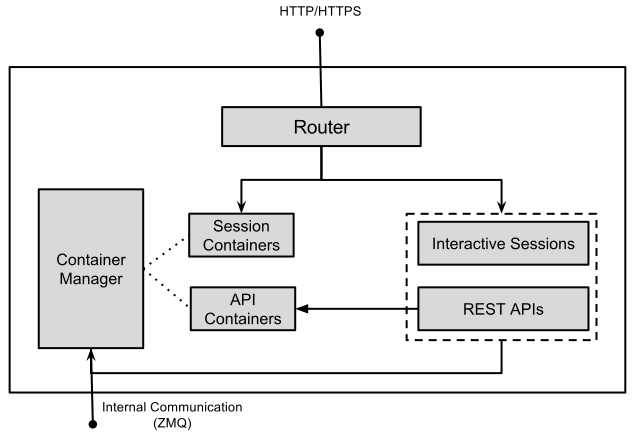
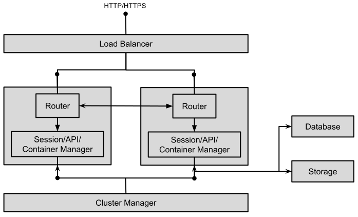

## Architecture

JuliaBox runs on Docker and Linux. All JuliaBox components are Docker containers.

- Router
    - Based on Nginx + Lua
    - Terminates HTTPS
    - Verifies requests based on cookie signatures
    - Routes connections to components either on same or other instances based on cookie values
    - Delivers static files
- Engine
    - App/Session Manager
        - Based on Tornado and communicates over HTTP
        - Handles authentication and sessions
        - Delivers the user interface
    - Container Manager
        - Interacts with App/Session manager over a ZMQ connection
        - Performs both asynchronous and request-response tasks
        - Interfaces with Docker and the host machine to provision other containers
        - The only component to run in priviledged mode

An single instance of JuliaBox is self contained with all components present in it. A JuliaBox cluster is a collection of instances using some common resources and aware of / connected to each other.

### Single Instance

The Router component can terminate HTTPS. Database can either be on the same machine or connected to remotely. A single instance deployment can scale to as far as the machine allows.

### Cluster

When deployed in a cluster, a front facing load balancer distributes incoming requests among the instances. It can also optionally offload HTTPS termination. All instances share facilities like databases and remote storage.

If allowed by the hosting environment, instances can be scaled up or down based on load. The default loading pattern tries to run fewer optimally instances while not disrupting existing sessions. Routers route requests to appropriate instances, either based on session location or configured loading pattern. Session/container managers can communicate among each other and are aware of states.

One instance in a cluster is elected as the leader and performs central tasks.

## Plugins

plugins can customize / provide additional features in JuliaBox. There are several plugin mount points, one for each 
category of functionalities. Plugin mount points are base classes that list a set of functionalities and provide common 
base methods if any. Each functionality expects the implementation class to provide certain methods. A plugin can 
provide one or more functionality.

Plugin implementations must extend the corresponding mount point, indicate functionalities implemented, and provide the 
required methods. Plugin providers are packged as a python package and a set of static files. A plugin becomes 
available in JuliaBox either if it is mentioned in the engine configuration or when it is used/imported by 
another plugin.

The plugin system is lightweight and flexible and does not perform any checks to ensure if implementations are 
providing the extected interface methods. An incorrect / incomplete plugin implementation will cause error on first use.
A typical plugin class looks like:
<pre>
class FooPluginImpl(FooPlugin):
    provides = [FooPlugin.FUNCTIONALITY_BAR1, FooPlugin.FUNCTIONALITY_BAR2]

    @staticmethod
    def impl_functionality1(...):
        ...

    @staticmethod
    def impl_functionality2(...):
        ...
</pre>

Available plugins and provided features can be queried from both server code (python) or client code (javascript), and the information can be used to disable/enable dependent features.

- `JuliBox.has_plugin_feature(feature_name)` on the browser
- `JBox.get_pluggedin_features()` on the server

### Database access and tables (JBPluginDB)
Provide database access and database table definitions.

- `JBPluginDB.JBP_DB`, `JBPluginDB.JBP_DB_DYNAMODB` and `JBPluginDB.JBP_DB_RDBMS`:
    Provide database access. Must implement the following methods.
    - `configure()`: Read and store database configuration.
    - `table_open(table_name)`: Open and return a handle to the named table. Subsequent operations on table shall pass the handle.
    - `record_create(table, data)`: Insert a new record with data (dictionary of column names and values).
    - `record_fetch(table, **kwargs)`: Fetch a single record. Keys passed in kwargs.
    - `record_scan(table, **kwargs)`: Scan all records in the table`. Required attributes passed in kwargs.
    - `record_query(table, **kwargs)`: Fetch one or more records. Selection criteria passed in kwargs.
    - `record_count(table, **kwargs)`: Count matching records. Selection criteria passed in kwargs.
    - `record_save(table, data)`: Update a single record with data (dictionary of column names and values)
    - `record_delete(table, data)`: Delete a single record with keys specified in data (dictionary of column names and values)
- `JBPluginDB.JBP_TABLE`, `JBPluginDB.JBP_TABLE_DYNAMODB` and `JBPluginDB.JBP_TABLE_RDBMS`:
    Provide a table implementation. Must extend `JBPluginDB` and provide the following attributes:
    - `TABLE`: to hold the opened table handle
    - `SCHEMA`, `INDEXES`: To define a dynamodb table (only if `JBP_TABLE_DYNAMODB` supported)
    - `KEYS`, `ATTRIBUTES`: To define a rdbms table (only if `JBP_TABLE_RDBMS` supported)
- `JBPluginDB.JBP_USAGE_ACCOUNTING`:
    Record JuliaBox usage data, per user/session and calculate stats. (Note: This will be moved out to a separate plugin in future).
    Must provide the following methods:
    - `record_session_time(session, image, start_time, end_time)`: Record usage
    - `get_stats(dates)`: Return statistics of JuliaBox usage across dates (list of dates)

### HTTP request handler (JBPluginHandler)
Provides additional request handler for session manager.

- `JBPluginHandler.JBP_HANDLER`, `JBPluginHandler.JBP_HANDLER_AUTH, JBPluginHandler.JBP_HANDLER_AUTH_ZERO, JBPluginHandler.JBP_HANDLER_AUTH_GOOGLE`:
    Provides a request handler that can be registered with tornado.
    - `register(app)`: register self with tornado application to handle the desired URI
- `JBPluginHandler.JBP_JS_TOP`:
    Provides path to a javascript file to be included in the top level window.

### Embedded UI widgets and sections (JBPluginUI)
Provide UI widgets/sections in a JuliaBox session.

- `JBPluginUI.JBP_UI_SESSION_HEAD`, `JBPluginUI.JBP_UI_AUTH_BTN` and `JBPluginUI.JBP_UI_CONFIG_SECTION`:
    Type `JBP_UI_SESSION_HEAD` is included in the head section of the session screen.
    Type `JBP_UI_AUTH_BTN` is a login widget/button displayed on the JuliaBox login screen.
    Type `JBP_UI_CONFIG_SECTION` included as a section in the JuliaBox configuration screen.
    All UI providers must implement the following method.
    - `get_template(plugin_type)`: Return path to a template with the corresponding section/widget.

### Storage volumes (JBoxVol)
Provides storage volumes that are mounted on to containers. All volume providers must extend from `JBoxVol`.

- `JBoxVol.JBP_USERHOME`, `JBoxVol.JBP_USERHOME_EBS`, `JBoxVol.JBP_USERHOME_LOCAL`:
    Provide storage for user home folder. These are usually faster but limited to smaller sizes.
    User home folders are overlaid with some configuration files required for working of JuliaBox.
- `JBoxVol.JBP_DATA`, `JBoxVol.JBP_DATA_EBS`:
    Provide larger volumes for storing data.
- `JBoxVol.JBP_PKGBUNDLE`:
    Provide read-only volumes that contain Julia packages and can be mounted on to containers.

All volume providers must implement the following methods:
- `configure()`: Initialize self. Configuration file can be accessed through JBoxCfg.
- `get_disk_for_user(user_id)`: Create, initialize and return an object representing a disk for the gived user id.
- `get_disk_from_container(cid)`: Return an object representing the disk mounted in the provided container if any.
- `is_mount_path(fs_path)`: Check if the provided path belongs to a disk managed by the plugin.
- `refresh_disk_use_status(container_id_list=None)`: Update status of all disks managed by the plugin by iterating through all containers.
- `disk_ids_used_pct()`: Percent of configured disks in use (indicates load on the system).
- `refresh_user_home_image()`: Update any pre-created disk images with a freshly downloaded JuliaBox user home image. Not required for data volumes.
- `release(backup)`: Release the disk. Backup contents if indicated.

### Cloud compute and related services (JBPluginCloud)
Interfaces with cloud service providers or provides similar services locally.

- `JBPluginCloud.JBP_BUCKETSTORE`, `JBPluginCloud.JBP_BUCKETSTORE_S3`:
    Provides storage for blobs of data in named buckets. Similar to Amazon S3 or OpenStack Swift.
    - `push(bucket, local_file, metadata=None)`
    - `pull(bucket, local_file, metadata_only=False)`
    - `delete(bucket, local_file)`
    - `copy(from_file, to_file, from_bucket, to_bucket=None)`
    - `move(from_file, to_file, from_bucket, to_bucket=None)`
- `JBPluginCloud.JBP_DNS`, `JBPluginCloud.JBP_DNS_ROUTE53`:
    DNS service.
    - `configure()`: Read and store configuration from JBoxCfg.
    - `domain()`: Return the domain name configured to be used
    - `add_cname(name, value)`: Add a CNAME entry
    - `delete_cname(name)`: Delete the specified CNAME entry.
- `JBPluginCloud.JBP_SENDMAIL`, `JBPluginCloud.JBP_SENDMAIL_SES`:
    E-Mail sending service.
    - `configure()`: Read and store configuration from JBoxCfg.
    - `get_email_rates()`: Rate limits to adhere to, as `daily_quota_remaining`,`rate_per_sec`
    - `send_email(rcpt, sender, subject, body)`: Send email as specified.
- `JBPluginCloud.JBP_COMPUTE`, `JBPluginCloud.JBP_COMPUTE_EC2`, `JBPluginCloud.JBP_COMPUTE_SINGLENODE`:
    Compute facility - start/stop instances to scale the cluster up or down based on the decided loading pattern,
    DNS, record and query load statistics which will be used in scaling decisions.
    - `configure()`: Read and store configuration from JBoxCfg.
    - `get_install_id()`: Returns an unique ID for the installation. This allows multiple installations on shared infrastructure.
    - `get_instance_id()`: Returns an identifier for each instance/machine.
    - `get_alias_hostname()`: Returns a hostname belonging to the installation domain with which the current instance can be reached.
    - `get_all_instances(gname=None)`
    - `get_instance_public_hostname(instance_id=None)`: hostname accessing from public network (may not be same as get_alias_hostname)
    - `get_instance_local_hostname(instance_id=None)`: hostname accessible within the cluster, but not from public network
    - `get_instance_public_ip(instance_id=None)`
    - `get_instance_local_ip(instance_id=None)`
    - `publish_stats(stat_name, stat_unit, stat_value)`: Record performance/load statistics.
    - `get_instance_stats(instance, stat_name, namespace=None)`: Query recorded statistics.
    - `get_cluster_stats(stat_name, namespace=None)`: Query cluster wide recorded statistics.
    - `get_cluster_average_stats(stat_name, namespace=None, results=None)`: Query cluster wide averages of recorded statistics.
    - `terminate_instance(instance=None)`: Terminate the specified instance. Self if instance is None.
    - `can_terminate(is_leader)`: Whether the instance can be terminated now (to scale down).
    - `should_accept_session(is_leader)`: Whether the instance can accept more load.
    - `get_redirect_instance_id()`: If the current instance is not ready to accept further load, a suggestion on which instance to load instead.
    - `get_image_recentness(instance=None)`: Whether the application image running on the instance is the latest.

### Container manager tasks (JBPluginTask)
Provide tasks that help with container management. They run in privileged mode and can interact with the host system if required.
Also provide tasks that are invoked periodically. Used to perform batch jobs, typically to collect statistics or cleanup failed/leftover entities.

- `JBPluginTask.JBP_CMD_ASYNC`:
    This functionality provides container manager commands that can be invoked from other parts of JuliaBox.
    - `do_task(plugin_type, data)`: Method must be provided.
        - `plugin_type`: Functionality that was invoked. Always `JBP_CMD_ASYNC` for now.
        - `data`: Data that the command was called with
- `JBPluginTask.JBP_NODE` and `JBPluginTask.JBP_CLUSTER`:
    Node specific functionality is invoked on all JuliaBox instances.
    Cluster functionality is invoked only on the cluster leader.
    - `do_periodic_task(plugin_type)`: Method must be provided.
        - `plugin_type`: Functionality that was invoked. Differentiator if multiple functionalities are implemented.
